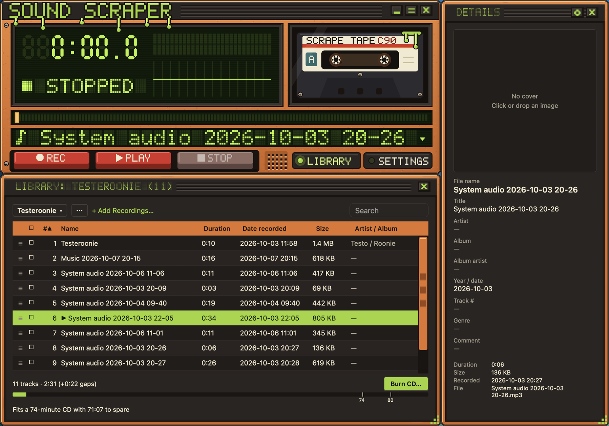
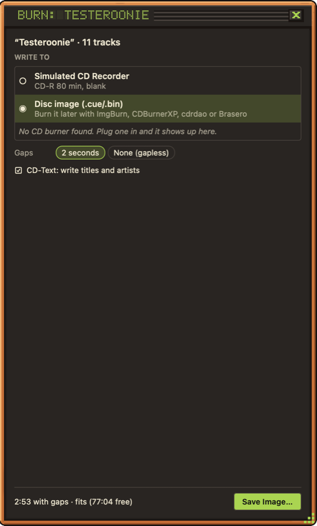
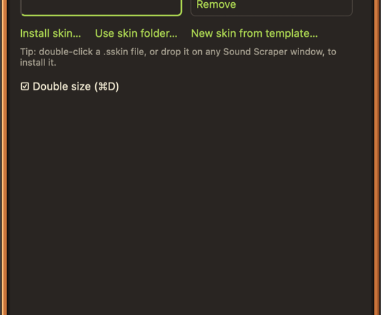
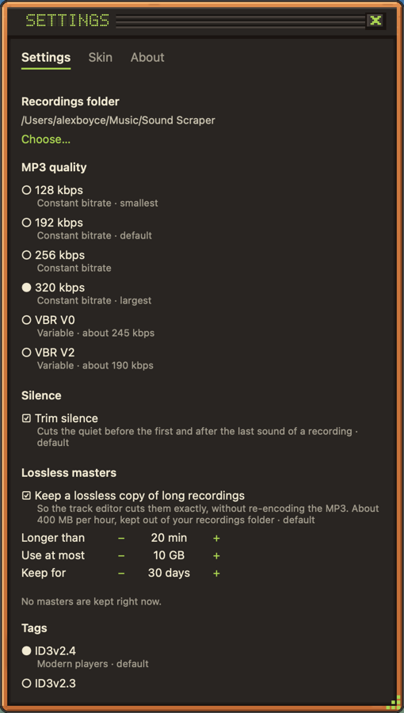

# Sound Scraper

Sound Scraper records whatever your computer is playing, either all system audio or just one app, straight to MP3. It keeps your recordings in a library where you can rename them, edit their tags, split them into tracks, play them back, put them in playlists and burn them to an audio CD. It runs on macOS and Windows, wrapped in a skinnable, WinAMP-style player.

## Install

Download the latest build from [GitHub Releases](https://github.com/curiosity26/sound-scraper/releases).

- **macOS** (Apple silicon, macOS 14.2 or later): open `SoundScraper-<version>.dmg` and drag Sound Scraper into Applications. The app is signed and notarized, so it opens normally.
- **Windows 10/11** (build 20348 or later for single-app capture): download the `.msix` for your PC, `ARM64` or `x64`, and double-click it to install. The package is signed, so Windows installs it without extra steps.

Releases marked *Pre-release* are betas. Each release has a `SHA256SUMS.txt` if you want to check your download.

### The first recording on macOS

macOS asks for **System Audio Recording** permission the first time you record. Allow it; without it the recording stays silent, and Sound Scraper warns you that no audio arrived. You can change it later in System Settings › Privacy & Security › Screen & System Audio Recording.

## Recording

1. Click the source display under the seek bar (the line with the ▾) and pick **All system audio**, or any app that has sound playing (♪ marks the ones playing right now). An app shows up once it has started playing. While a recording is loaded for playback, that line shows its title instead.
2. Press **REC**. The clock counts up, and the visualizer and level meters follow the audio.
3. Press **Pause** (the Play button turns into Pause while recording) to skip a stretch, such as an ad. Press it again to carry on in the same file; the paused part is simply left out.
4. Press **STOP**. The recording is saved as an MP3 in your recordings folder and appears in the library.

Recordings are named `<Source> YYYY-MM-DD HH-MM.mp3` and saved in `~/Music/Sound Scraper` (on Windows, `Music\Sound Scraper`) unless you choose another folder in Settings. They're tagged with the title, the recording date and, for an app source, "Recorded from <App>".

**Silence trimming** is on by default: silence before the first sound and after the last one is cut off, so a recording starts when the music does. Quiet passages in the middle are kept. Turn it off in Settings if you want everything.

If the app or the computer crashes mid-recording, the partial recording is repaired and added to your library the next time Sound Scraper starts.

## Library

Click **LIBRARY** to open the library panel. It lists every MP3 in your recordings folder with its duration, date, size, artist and album.

- Click a column header to sort; click it again to reverse.
- Type in **Search** to filter by name, title, artist or album.
- Right-click a recording for **Edit Track…**, **Add to Playlist…**, **Show in Finder** (Explorer on Windows), **Change cover…** and **Move to Trash** (Recycle Bin).
- To rename a recording, click its **File name** in the Details panel and type the new name.

Renaming keeps the `.mp3` extension and updates the title tag too, unless you had already given the recording a different title. Files you add to or remove from the folder yourself show up in the library a moment later.

## Editing tags

Select a recording and its tags appear in the **Details** panel: title, artist, album, album artist, year, track number, genre, comment and cover art. Click a field to change it, and click or drop a PNG or JPEG on the cover to set the artwork.

To tag several recordings at once, tick their boxes (the header box ticks them all) and edit them together. Fields that differ show "Multiple values" and are only changed if you type in them.

Tags are saved as ID3v2.4. For older players, car stereos and Windows, choose **ID3v2.3** instead, per recording or as the default in Settings. A save never damages the recording, even if it's interrupted.

## Splitting a recording into tracks

A long recording, such as a whole album or a radio show, can be split into separate tracks in the track editor. Choose **Edit Track…** from a recording's right-click menu or the details gear menu.

- **Play** and scrub: click the time ruler to move the playhead, or drag along it to hear where you are. Space plays and pauses.
- **Slice** (or press M) at the playhead to start a new track there. Drag a slice's edge to move it, and double-click a track to name it. The name becomes both the title and the file name.
- **Auto Slice** finds the gaps between songs for you. Pick a preset (*Digital* or *Vinyl / Radio*) or tune the silence level and lengths, check the proposed slices, then **Add Slices**.
- **Delete** a stretch you don't want (an ad, a DJ talking, dead air): drag across the waveform to select it, then **Delete Selection**. Click a deleted stretch to **Restore** it.
- Zoom with the sliders around the waveform, **Fit** to see it all, and toggle **Snap** to snap slices to the ruler. Undo and redo work as usual.

Nothing changes until you press **Save…**, which asks whether to keep the original recording: **Yes, keep it** or **No, delete it**. The new tracks keep all of the original's tags except the title, and are numbered 1/N to N/N. Cuts are made without re-encoding, so the tracks sound exactly like the original; only a track with a deleted stretch inside it is re-encoded.

For long recordings, Sound Scraper can also keep a lossless master while recording, so every cut lands exactly where you put it. Settings › **Lossless masters** chooses which recordings get one, how long masters are kept and how much disk they may use.

## Playback

Select a recording in the library and press **PLAY**. Drag the seek bar to jump around, and press **STOP** to rewind. In a playlist, playback continues with the next track. Pressing **REC** at any time stops playback and starts a new recording.

## Playlists

The menu at the top left of the library switches between **Library** (every recording) and your playlists.

- **New Playlist…** creates one. Add recordings with **+ Add Recordings…**, with **Add to ▾** on ticked rows, or with **Add to Playlist…** on a recording's right-click menu.
- Drag rows by their handle (≡) to reorder a playlist. **Remove from Playlist** takes a recording out without deleting it.
- The **⋯** button renames, duplicates or deletes the playlist, or exports it as an `.m3u8` file.
- New recordings made while a playlist is showing are added to it.

Under a playlist, a bar shows how much of a 74- or 80-minute CD it fills, gaps included.

## Burning a CD

With a playlist showing, click **Burn CD…** to burn it to an audio CD that plays in any CD player. Choose the drive, speed and the gap between tracks (2 seconds by default, or none for gapless albums), and optionally write CD-Text so players show titles and artists. **Test write** runs everything except the laser, to check a disc would burn fine. While burning, the panel shows each track's progress, the drive buffer and a log you can save.

Without a CD writer, the button reads **Save CD Image…** and writes the playlist as a `.cue`/`.bin` disc image instead, which you can burn later with ImgBurn, CDBurnerXP, cdrdao or Brasero.

## Skins

The whole player is skinnable. Open **SETTINGS** › **Skin** to switch skins, **Install skin…** to add a `.sskin` file, or **New skin from template…** to start your own. You can also double-click a `.sskin` file, or drop it on any Sound Scraper window, to install it. Anything a skin leaves out falls back to the Default skin.

- Drag a panel by its title bar. Panels snap to each other and dock; dragging the main panel moves everything docked to it (hold Option on macOS to drag freely).
- Double-click the title bar for the one-line "shade" mode, and use Window › Double Size (⌘D) to draw the player at twice the size.
- Click the visualizer to cycle its styles.

Skin authors: the format is described in [docs/skins.md](docs/skins.md), and [skins/hifi74](skins/hifi74) is a full example skin you can load with **Use skin folder…**.

## Settings

**SETTINGS** also holds the recordings folder, MP3 quality (128 to 320 kbps, or VBR V0/V2), silence trimming, the default ID3 version and lossless masters. Sound Scraper remembers the last source you recorded from. **About** lists the open-source components it uses.

## Development

Sound Scraper is a Rust core (capture, encoding, playback, library, skins, CD burning) under a React Native app for macOS and Windows.

- [docs/development.md](docs/development.md): project layout, building from source on macOS and Windows, the native API and licensing.
- [docs/release.md](docs/release.md): cutting a signed release from a version tag.
- Design notes: [docs/design.md](docs/design.md), [docs/skins.md](docs/skins.md), [docs/track-editor-design.md](docs/track-editor-design.md), [docs/playlists-and-cd-burning-design.md](docs/playlists-and-cd-burning-design.md).

MP3 encoding uses [LAME](https://lame.sourceforge.io/) (LGPL), linked dynamically.
